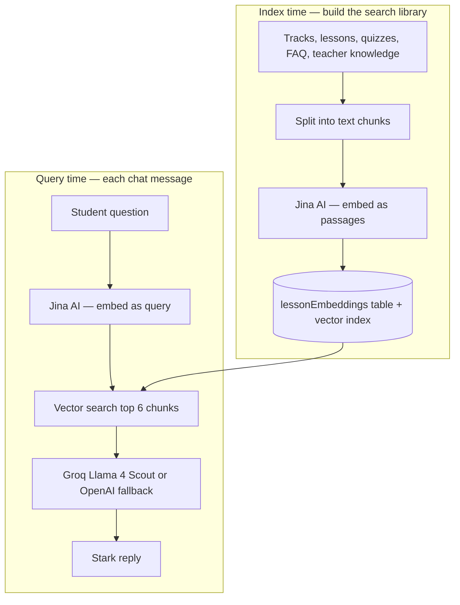

# Stark RAG — How It Works

This document explains the **Retrieval-Augmented Generation (RAG)** system that powers **Stark**, the ComplxSimple AI assistant.

In plain English: we **store searchable copies of course content as numbers (embeddings)**, and when a student asks a question we **find the most relevant pieces**, paste them into the prompt, and let the LLM answer using that context.

---

## The big picture



**Index time** happens when you run “Sync Stark now” in Teacher Hub or when Cassandra saves a knowledge doc.  
**Query time** happens on every message in `/stark`.

---

## Design choices (why we built it this way)

| Choice | What we did | Why |
|--------|-------------|-----|
| Where vectors live | Convex table `lessonEmbeddings` + `vectorIndex("by_embedding")` | Same database as the app; reactive, no separate vector DB to run |
| Embedding model | [Jina `jina-embeddings-v3`](https://jina.ai/), 1024 dimensions | Good quality; separate tasks for **documents** vs **questions** |
| Chat model | Groq **Llama 4 Scout** first, **GPT-4o-mini** fallback | Fast/free tier friendly; still works if Groq is down |
| Chunking | ~1200 characters, split on paragraph breaks | Keeps each search result focused; long teacher docs split into parts |
| Retrieval | Top **6** chunks per question | Enough context without blowing up the prompt |
| Teacher knowledge | `knowledgeDocs` table + auto re-index on save | Cassandra can teach Stark policies, schedules, etc. without code changes |
| Grounding | System prompt + injected `COURSE CONTEXT` | Stark answers general questions too, but **won’t invent** ComplxSimple-specific facts |
| Safety | Rule-based filters **before and after** the LLM | Extra guardrails for slurs, politics, etc. in a student environment |

---

## Data model

Chunks live in `lessonEmbeddings` (see [`convex/schema.ts`](../../convex/schema.ts)):

```typescript
lessonEmbeddings: defineTable({
  lessonId: v.optional(v.id("lessons")),
  trackId: v.optional(v.id("tracks")),
  source: v.string(),       // "track" | "lesson" | "faq" | "knowledge"
  title: v.string(),
  chunkText: v.string(),
  embedding: v.array(v.float64()),
})
  .vectorIndex("by_embedding", {
    vectorField: "embedding",
    dimensions: 1024,
  }),
```

Teacher-editable text is stored separately in `knowledgeDocs` and **copied into chunks** when the index is rebuilt.

---

## Part 1 — Building the index (`convex/embeddings.ts`)

### 1. Gather all text to embed

An internal query loads tracks, lessons, quiz questions, and knowledge docs:

```typescript
export const getAllContent = internalQuery({
  args: {},
  handler: async (ctx) => {
    const tracks = await ctx.db.query("tracks").collect();
    const lessons = await ctx.db.query("lessons").collect();
    const questions = await ctx.db.query("quizQuestions").collect();
    const knowledge = await ctx.db.query("knowledgeDocs").collect();
    return { tracks, lessons, questions, knowledge };
  },
});
```

### 2. Turn lesson JSON into plain text

Lessons are stored as JSON blocks (headings, quizzes, crosswords, code playgrounds). `lessonContentToText` flattens them so embeddings see normal sentences:

```typescript
function lessonContentToText(content: string): string {
  const parsed = JSON.parse(content);
  const blocks = Array.isArray(parsed.blocks) ? parsed.blocks : [];
  // ... switch on block type: heading, paragraph, quiz, crossword, etc.
  return parts.join("\n");
}
```

### 3. Chunk long documents

Teacher knowledge (and huge paragraphs) get split so search returns a **specific section**, not a whole essay:

```typescript
function chunkText(text: string, maxLen = 1200): string[] {
  // Split on blank lines; hard-split if a single paragraph exceeds maxLen
}
```

### 4. What goes into the index

Each rebuild adds chunks from:

- **track** — name, slug, description  
- **lesson** — track + title + flattened content + linked quiz Q&A  
- **faq** — static “how the site works” copy (homework, crosswords, Cassandra, etc.)  
- **knowledge** — Cassandra’s docs from Teacher Hub → Stark Knowledge  

Then the old index is wiped and replaced:

```typescript
await ctx.runMutation(internal.embeddings.clearEmbeddings, {});

for (let i = 0; i < chunks.length; i += BATCH) {
  const vectors = await embedBatch(batch.map((c) => c.chunkText));
  // insert each chunk + vector into lessonEmbeddings
}
```

### 5. Call Jina for document embeddings

Documents use `task: "retrieval.passage"` (optimized for **stored** text):

```typescript
body: JSON.stringify({
  model: "jina-embeddings-v3",
  task: "retrieval.passage",
  dimensions: 1024,
  input: inputs,
}),
```

### 6. Public entry points

| Function | Who calls it | Purpose |
|----------|--------------|---------|
| `embeddings.generateAllEmbeddings` | Teacher “Sync Stark now” button | Full rebuild |
| `embeddings.rebuildAll` (internal) | Scheduled after knowledge create/update/delete | Same rebuild, async |

---

## Part 2 — Teacher knowledge (`convex/knowledge.ts`)

When Cassandra saves a knowledge doc, we **don’t** embed inline in the mutation. We schedule a rebuild so the action can call Jina and write many rows safely:

```typescript
await ctx.db.insert("knowledgeDocs", { title, content, /* ... */ });
await ctx.scheduler.runAfter(0, internal.embeddings.rebuildAll, {});
```

UI: [`src/components/teacher/KnowledgeManager.tsx`](../../src/components/teacher/KnowledgeManager.tsx) — also has a manual **Sync Stark now** that calls `generateAllEmbeddings`.

---

## Part 3 — Answering a question (`convex/chat.ts`)

The RAG loop lives in `chat.sendMessage`:

### Step 0 — Safety check (no LLM yet)

```typescript
const inputRefusal = getSafetyRefusal(userText);
if (inputRefusal) {
  return { reply: inputRefusal, conversationId: convId };
}
```

### Step 1 — Embed the **question** (different Jina task)

Queries use `retrieval.query` (not `retrieval.passage`):

```typescript
body: JSON.stringify({
  model: "jina-embeddings-v3",
  task: "retrieval.query",
  dimensions: 1024,
  input: [text],
}),
```

### Step 2 — Vector search in Convex

```typescript
const results = await ctx.vectorSearch("lessonEmbeddings", "by_embedding", {
  vector: queryVector,
  limit: 6,
});
```

### Step 3 — Load chunk text for those IDs

```typescript
const chunks = await ctx.runQuery(internal.chat.getChunksByIds, {
  ids: results.map((r) => r._id),
});
```

### Step 4 — Inject context into the system prompt

```typescript
const context = chunks
  .map((c, i) => `[${i + 1}] ${c.title}\n${c.chunkText}`)
  .join("\n\n");

const systemPrompt = `${SYSTEM_PERSONA}\n\n${dateNote}\n\n=== COURSE CONTEXT ===\n${context}\n=== END CONTEXT ===`;
```

`SYSTEM_PERSONA` tells Stark to use context for **ComplxSimple-specific** facts but still act as a general tutor for other topics.

### Step 5 — Chat completion

```typescript
let reply = await chatComplete(llmMessages);
reply = sanitizeReply(userText, reply);
```

`chatComplete` tries **Groq** first, then **OpenAI** if Groq fails or is missing.

### Step 6 — Save conversation

Messages go to `starkConversations` / `starkMessages` via `conversations.create` and `addMessage`. New chats get an auto-generated title.

---

## Part 4 — Frontend (`src/app/(auth)/stark/page.tsx`)

The Stark page keeps **local message history** and sends it with each request:

```typescript
const sendMessage = useAction(api.chat.sendMessage);

const { reply, conversationId } = await sendMessage({
  conversationId: activeConvoId ?? undefined,
  userText: text,
  history: messages.filter((m) => m !== GREETING).slice(-8),
});
```

Rendering uses [`StarkMessage`](../../src/components/stark/StarkMessage.tsx) for markdown and code blocks.

---

## Environment variables (Convex dashboard)

Set these on your **Convex deployment** (not in `.env.local` for server actions):

| Variable | Used for |
|----------|----------|
| `JINA_API_KEY` | Embeddings at index time and query time |
| `GROQ_API_KEY` | Primary chat (optional but recommended) |
| `OPENAI_API_KEY` | Chat fallback if Groq fails |

Without `JINA_API_KEY`, indexing and RAG search will error. Without both chat keys, replies will fail after retrieval succeeds.

---

## Operational checklist

1. **First time / after big content changes:** Teacher Hub → Stark Knowledge → **Sync Stark now** (or run `embeddings.generateAllEmbeddings` from the Convex dashboard).
2. **After Cassandra edits knowledge:** Re-index runs automatically within a few seconds.
3. **After seeding new lessons:** Run a full sync so new lesson text is embedded.
4. **Students:** Open `/stark` and ask course questions; retrieved chunks drive grounded answers.

---

## File map

| File | Role |
|------|------|
| [`convex/schema.ts`](../../convex/schema.ts) | `lessonEmbeddings` + vector index; `knowledgeDocs` |
| [`convex/embeddings.ts`](../../convex/embeddings.ts) | Chunking, Jina batch embed, rebuild index |
| [`convex/knowledge.ts`](../../convex/knowledge.ts) | Teacher CRUD + schedule rebuild |
| [`convex/chat.ts`](../../convex/chat.ts) | Query embed, vector search, LLM, safety |
| [`convex/conversations.ts`](../../convex/conversations.ts) | Persist Stark chats |
| [`src/app/(auth)/stark/page.tsx`](../../src/app/(auth)/stark/page.tsx) | Chat UI |
| [`src/components/teacher/KnowledgeManager.tsx`](../../src/components/teacher/KnowledgeManager.tsx) | Manage knowledge + manual sync |

---

## Mental model (one sentence)

**We pre-compute “what the course knows” as vectors; each question finds the closest pieces and the LLM reads those notes before answering.**

That’s RAG — retrieval first, generation second.
